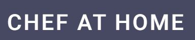
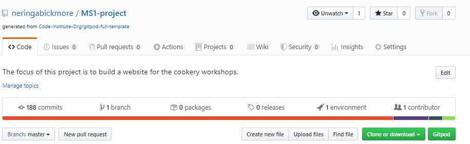

## Cheft at home - First Milestone Project - Code Institute (https://codeinstitute.net/)

The aim of the project is to showcase my ability to design and build a static web page using HTML, CSS and Bootstrap for my First Milestone project at Code Institute, Full Stack Developer. 

The focus of the project is to build a website for the audience who would like to learn how to cook and invite them to join the workshops. This is a fictional website with a potential for a real business venture. In the future, this website can improve by incorporating the "how to/recipe demo" videos. It would also be advantagerous to have a "shopping basket" with online payment capabilities as well as user account for returning customers. 

## UX
The purpose of the website is to present the information about the workshops: 
1. what they are
2. who they are designed for
3. what you will learn and 
4. why we are doing this. 

I also wanted to make sure the website is intuitive, easy to navigate and not overloaded with too much unnecesary content. It was also very important to me that the user feels welcomed, wants to stay on the page, feels drawn to get to know us and book a workshop.

### User Stories
* As a parent, I want to make sure child friendliness.
* As a young professional, I don't want to waste my time I don't have for overcomplications.
* I am vegan/vegetarian and I want to make sure the workshops are tailored to suit my diet.
* As somebody who wants to "try before you buy" I want to have sample recipies to try at home before considering to booking a workshop.

## Features
### Existing Features
* __Header navigation buttons__ - Allows the user to navigate through pages back and forth: Home, Recipes, Workshop.
* __Home Page__ - Includes a brief introduction, a few images taken from previous workshops (assumed) as well as client testimonials (to build trust and add credibility).
* __Recipes Page__ - Page showcases an option to view and try some recipes at home. By clicking on the buttons BREAKFAST, LUNCH, DINNER the user triggers a modal, which displays recipes on a pop-up box. The user will navigate the pop-up with the scroll on the right hand side. To exit the recipe: 1) click close button at the top of the page and 2) close button at the bottom of the page.
* __Workshop Page__ - This page showcases a form allowing to book a workshop. Form has Name and Email Address set as mandatory requirement. Also, the form will not allow submission if the consent button is ticked. Two sections of the form (Workshop & Date and Select Party Size) allows the user to choose appropriate option for the booking. I have also included "Do we need to know anything else" section, for sharing any important information, if the party size is larger than the option given or they would like more tailored services. The text input area can be expanded/reduced to suit the users preference. Once the form is complete, BOOK button is active to complete the booking.
* __Social links in the footer__ - This part of every page provides the user with the option to connect with us via social media platforms as well as send us an email directly. Each button will open up on a new browset window or email software on your machine if you select to send an email. 
### Features Left to Implement
* __Recipe Demo__ - This feature is for showcasing how to prepare the meals in a video format. 
* __Workshop Page__ - BOOK button to enable the user to physically book a session and pay online.
* __Basket__ - Feature allowing the user to select multiple workshops and add them to the basket to pay later.
* __Returning User__ - Allow the returning user to create their profile to keep on learning new skills.

## Technologies Used
1. **HTML (hyper text markup language):** Utilised to build all of the pages of the web site. More information on this language here: https://www.w3schools.com/html/default.asp 
2. **CSS (cascading style sheets):** Allows to style different elements of the page, such as color, fonts, size, etc. More information on this language here: https://www.w3schools.com/css/default.asp
3. **Bootstrap:** A pre-customised CSS templates, allowing the coder to quickly create responsive, mobile-first front-end websites. More information about this framework here: https://getbootstrap.com/
4. **GitHub:** A vendor providing a hosting for software development and its version control when you use Git. Read more here: https://github.4 
5. **Gitpod:** I have heavily utilised this online IDE to create and save code, which is run in a browser. You do not need to install the software onto your PC.  More information about this IDE here: https://www.gitpod.io/
6. **Git:** Allows to track and control changes made in source code during the development. Read more here: https://git-scm.com/
7. **Chrome DevTools:** I have heavily relied on using these web developer tools that are built into Google Chrome browser directly. These tools allowed me to quickly spot styling changes that need modification as well as trial new CSS before implementing it in the source code. You can find more information about this excellent bit of kit here: https://developers.google.com/web/tools/chrome-devtools
8. **W3C Markup Validation Service:** I used this website to validate my css and html at the end of the software development as a spotcheck for errors. More information here: https://validator.w3.org/#validate_by_input

## Testing
NEED TO WRITE UP!

## Deployment
1. I created an account on GitHub: https://github.com/neringabickmore
2. I have used full Code Institute gitpod template (https://github.com/Code-Institute-Org/gitpod-full-template) and created the following repository: https://github.com/neringabickmore/MS1-project
3. To publish the project for public view I have followed below steps: 
        (1) Went to settings in the repository;
        (2) Scrolled to the heading "GitHub Pages";
        (3) The source settings have a drop down menu where I selected master branch for publishing, which I then saved;
        (4) My site was then published at: https://neringabickmore.github.io/MS1-project/
4. To run the code on your computer, follow the link for my repository (https://github.com/neringabickmore/MS1-project) where you will see the following:

5. You can select to clone or download the code (clone with HTTP, open in descktop or download a zip file)
6. To clone the repository, you can: 
        (1) Open in Git Bash
        (2) Change the location where you want to re-direct the clone
        (3) Type up the git clone, paste the URL (https://github.com/neringabickmore/MS1-project.git) and press enter to create your local clone.

For more information on the process here: https://help.github.com/en/github/creating-cloning-and-archiving-repositories/cloning-a-repository 
###### *Gitpod Reminder: To run a frontend (HTML, CSS, Javascript only) application in Gitpod, in the terminal, type: `python3 -m http.server`

## Credits
### Content
 1. HTML & CSS (and JS to activate modal) code templates identified on Bootstrap documentation (https://getbootstrap.com/docs/4.5/getting-started/introduction/)
 2. Modal inspiration: https://codepen.io/Eventyret/pen/ExVeOme?editors=1010
 3. I have identified font styles using Google Fonts: https://fonts.google.com/

### Media
1. All images are taken from: https://unsplash.com/photos/. I have used the following artists images: 

    (1) https://unsplash.com/@marius_dragne
    (2) https://unsplash.com/@catalinnp
    (3) https://unsplash.com/@minkmingle
    (4) https://unsplash.com/@calumlewis
    (5) https://unsplash.com/@anniespratt
    (6) https://unsplash.com/@danedeaner
    (7) https://unsplash.com/@sadswim
    (8) https://unsplash.com/@allentaylorjr
    (9) https://unsplash.com/@the_modern_life_mrs
    (10) https://unsplash.com/@miracletwentyone

2. I utilised Font Awesome for all social media icons: https://fontawesome.com/
3. Color paletts and mixers identified here: https://www.w3schools.com/w3css/w3css_color_generator.asp https://www.w3schools.com/colors/colors_mixer.asp
4. I have used my laptop's own MS Paint to compress jpg images.
5. I have used my laptop's own MS Edit with Photos to apply the same size (aspect ratio 10:8) and filter (Rouge) to all of the images used on the website. 
6. I used snippet tool for the screengrabs utilised in the README.md.

## Acknowledgements

